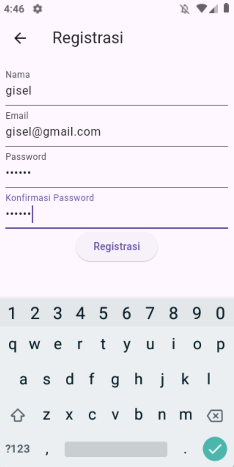
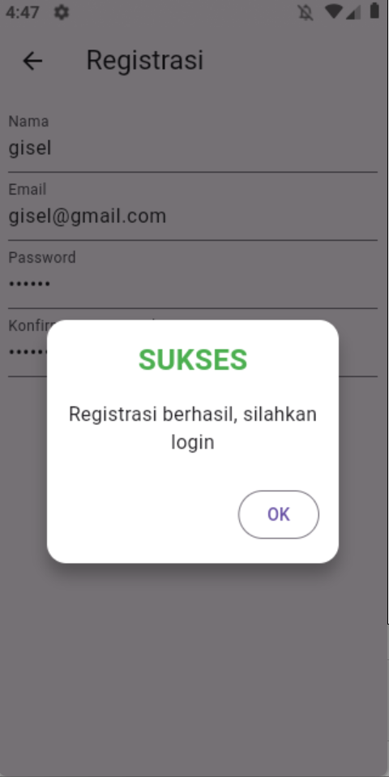
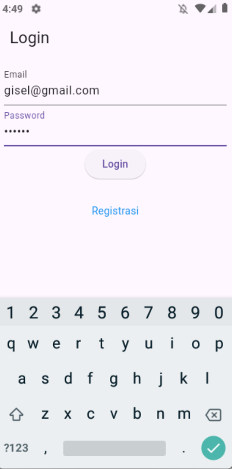
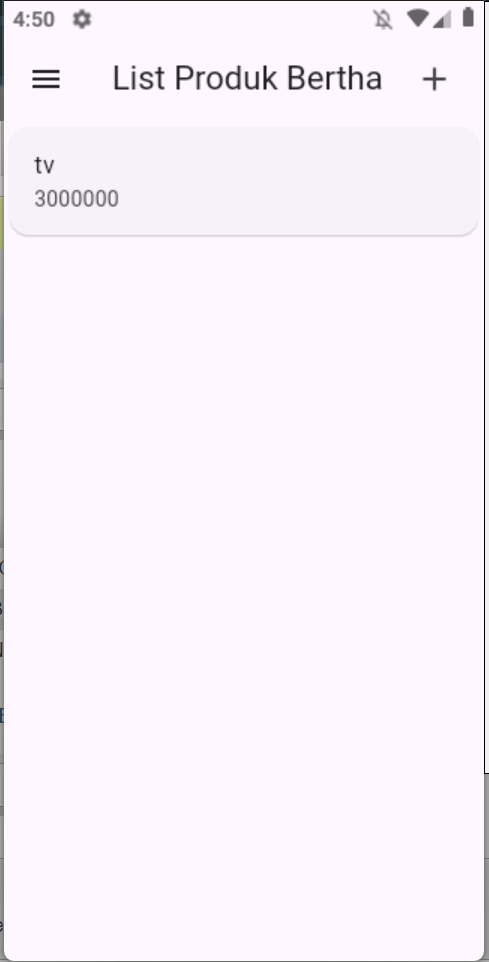
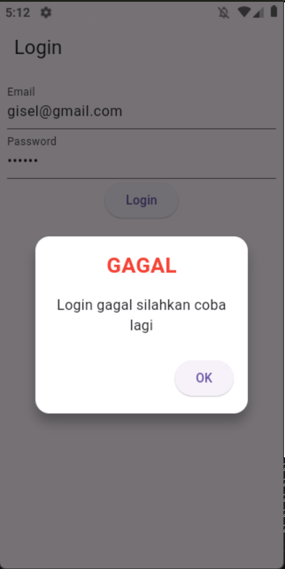
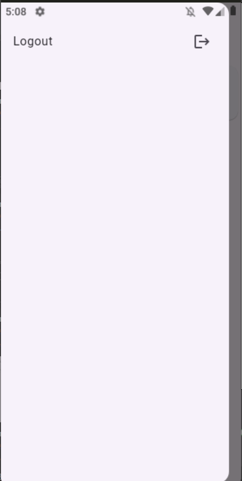
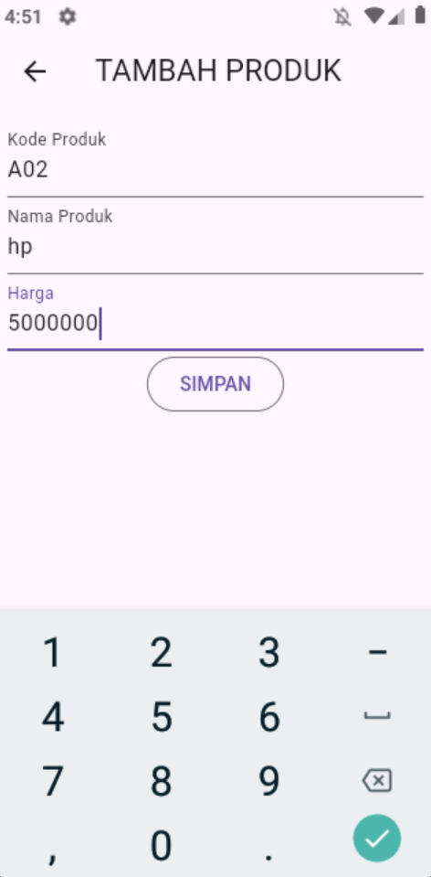
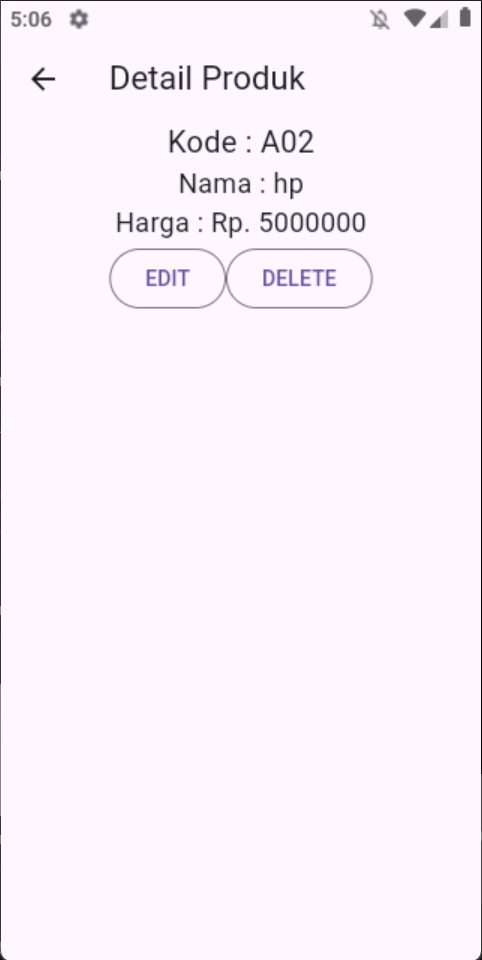
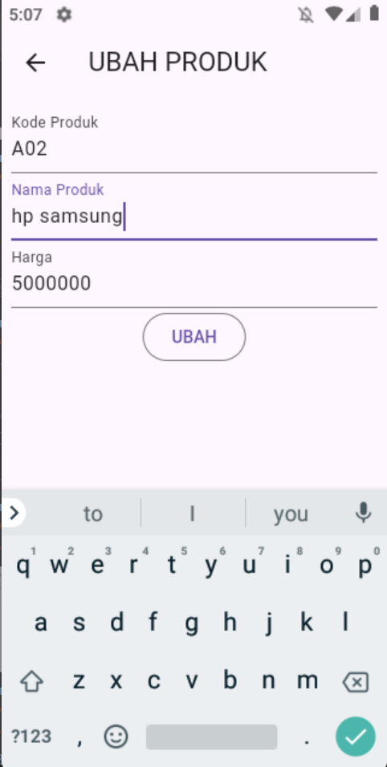
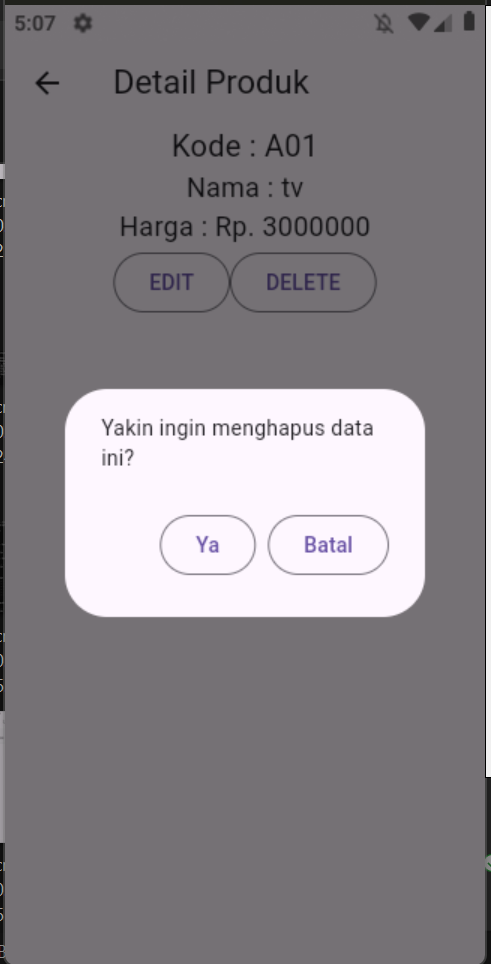

# Tugas 4
Nama : Claresta Berthalita Jatmika

NIM : H1D022050

Shift Baru: F

## Screenshoot Program
### 1. Halaman Registrasi
halaman ini memungkinkan pengguna untuk melakukan registrasi


### 2. Halaman Login
halaman ini memungkinkan pengguna untuk melakukan login


### 3. Halaman List Produk
halaman ini memungkinkan pengguna untuk melihat list produk yang ada


### 4. Halaman Tambah Produk
halaman ini memungkinkan pengguna untuk menambahkan produk


### 5. Halaman Detail Produk
halaman ini memungkinkan pengguna untuk melihat detail data produk


### 6. Halaman Ubah Produk
halaman ini memungkinkan pengguna untuk mengedit data produk


# Tugas 5
Nama : Claresta Berthalita Jatmika

NIM : H1D022050

Shift Baru: F

## Penjelasan Program
### 1. Proses Registrasi
#### a. 
Pada gambar diatas, saya mencoba melalukan proses registrasi dengan menginputkan formulir registrasi yaitu nama, email, password, dan konfirmasi password. Dibawahnya terdapat button registrasi yang akan mengirimkan data pada formulir ke dalam sistem. Setelah pengguna menekan tombol registrasi, sistem akan melakukan validasi dengan menggunakan 'FormState'. Jika berhasil maka fungsi '_submit()' dipanggil. Pada fungsi '_submit()' inputan formulir akan disimpan dan dikirim ke API backend melalui 'RegistrasiBloc.registrasi'. Pada 'registrasi_bloc.dart' metode 'registrasi' melakukan permintaan HTTP POST ke endpoint registrasi API menggunakan 'Api().post()' dengan mengirimkan data dalam bentuk JSON.
```dart
void _submit() {
    _formKey.currentState!.save();
    setState(() {
      _isLoading = true;
    });
    RegistrasiBloc.registrasi(
            nama: _namaTextboxController.text,
            email: _emailTextboxController.text,
            password: _passwordTextboxController.text)
        .then((value) {
```


#### b. 
Jika registrasi berhasil dilakukan maka akan menampilkan 'SuccessDialog' dengan pesan 'Registrasi berhasil, silahkan login' seperti gambar diatas. Tetapi jika terdapat error maka akan ditampilkan 'WarningDialog' dengan pesan 'Registrasi gagal, silahkan coba lagi'. 
```dart
      showDialog(
          context: context,
          barrierDismissible: false,
          builder: (BuildContext context) => SuccessDialog(
                description: "Registrasi berhasil, silahkan login",
                okClick: () {
                  Navigator.pop(context);
                },
              ));
    }, onError: (error) {
      showDialog(
          context: context,
          barrierDismissible: false,
          builder: (BuildContext context) => WarningDialog(
                description: "Registrasi gagal, silahkan coba lagi",
              ));
    });
  }
```

### 2. Proses Login
#### a. 
Pada halaman ini memungkinkan pengguna untuk melakukan proses login dengan memasukkan inputan pada form login yang tersedia. Form tersebut berisi email dan password yang harus diisi oleh pengguna seperti gambar diatas. Setelah pengguna mengisi form login tersebut pengguna memencet tombol "Login" yang ada dibawah form. Jika sudah memencet tombol, maka sistem akan melakukan validasi apakah data yang diinputkan sesuai dengan  syarat, jika validasi berhasil maka selanjutnya akan dipangil fungsi '_submit()'.
```dart
Widget _buttonLogin() {
    return ElevatedButton(
      child: const Text("Login"),
      onPressed: () {
        var validate = _formKey.currentState!.validate();
        if (validate) {
          if (!_isLoading) _submit();
        }
      },
    );
  }
```
#### b. 
Pada fungsi '_submit()' akan memanggil 'Loginbloc.login()' untuk mengirim data email di '_emailTextboxController' dan password di '_passwprdTextboxController' ke server menggunakan API dengan methode POST. Respon dari server diterima, kemudian diubah menjadi objek model Login dengan menggunakan fromJson. Jika login berhasil dilakukan(respon server mempunyai code 200) token dan userID yang didapatkan dari server disimpan menggunakan 'UserInfo()' untuk penggunaan selanjutnya, dan pengguna diarahkan ke halaman 'ProdukPage()' dengan menggunakan 'Navigator.pushReplacement'.
```dart
void _submit() {
    _formKey.currentState!.save();
    setState(() {
      _isLoading = true;
    });
    LoginBloc.login(
            email: _emailTextboxController.text,
            password: _passwprdTextboxController.text)
        .then((value) async {
      if (value.code == 200) {
        await UserInfo().setToken(value.token.toString());
        await UserInfo().setUserID(int.parse(value.userID.toString()));
        Navigator.pushReplacement(context,
            MaterialPageRoute(builder: (context) => const ProdukPage()));
      }
```
#### c. 
Apabila data yang diisi pengguna pada form login mempunyai kesalahan maka akan muncul popup peringatan dari 'WarningDialog()' dengan pesan 'Login gagal silahkan coba lagi'. Lalu apabila pengguna memencet "OK" pada popup peringatan tersebut maka popup akan tertutup.
```dart
else {
        showDialog(
            context: context,
            barrierDismissible: false,
            builder: (BuildContext context) => const WarningDialog(
                  description: "Login gagal silahkan coba lagi",
                ));
      }
    }, onError: (error) {
      print(error);
      showDialog(
          context: context,
          barrierDismissible: false,
          builder: (BuildContext context) => const WarningDialog(
                description: "Login gagal silahkan coba lagi",
              ));
    });
```

### 3. Proses Tampil Produk (List Produk)
#### a. 
Pada halaman ini sistem akan menampilkan list produk yang terdaftar pada sistem menggunakan 'FutureBuilder' yang berguna untuk mengambil data produk secara asynchronous melalui 'ProdukBloc.getProduks()' dari API. Jika produk berhasil diambil maka 'ListProduk' akan ditampilkan. Tetapi apabila ada error dan masih berada dalam proses maka 'CircularProgressIndicator' akan ditampilkan.
```dart
body: FutureBuilder<List>(
          future: ProdukBloc.getProduks(),
          builder: (context, snapshot) {
            if (snapshot.hasError) print(snapshot.error);
            return snapshot.hasData
                ? ListProduk(
                    list: snapshot.data,
                  )
                : const Center(
                    child: CircularProgressIndicator(),
                  );
          },
        )
```

#### b. Pengambilan data dari API
Diatas sudah dijelaskan bahwa pengambilan data menggunaka 'ProdukBloc.getProduks()'. Fungsi ini melakukan permintaan GET ke API untuk mengambil data produk. Setiap produk yang diterima dari API diubah menjadi objek Produk melalui metode fromJson() pada model Produk.
```dart
    List<dynamic> listProduk = (jsonObj as Map<String, dynamic>)['data'];

```

#### c. Menampilkan data dari API
Untuk menampilkan list produk menggunakan 'ListProduk' dimana pada bagian widget nya daftar produk akan ditampilkan dengan menggunakan 'ListView.builder()'. Dengan 'itemCount' berguna untuk mengatur jumlah produk yang ditampilkan berdasar panjang daftar produk yang didapat dari API. Sedangkan 'itemBuilder' berguna untuk tiap produk, komponen 'ItemProduk()' akan ditampilkan dengan memuat nama dan harga produk. 
```dart
Widget build(BuildContext context) {
    return ListView.builder(
        itemCount: list == null ? 0 : list!.length,
        itemBuilder: (context, i) {
          return ItemProduk(
            produk: list![i],
          );
        });
  }
```
Selanjutnya apabila pengguna memencet salah satu daftar produk yang tersedia sistem akan mengarahkan ke halaman detail produk dengan menggunakan 'Navigator.push()'.

#### d. 
Pada halaman List Produk terdapat side menu yang didalamnya terdapat fitur untuk logout. Dengan menggunakan 'drawer' dan memanggil fungsi 'LogoutBloc.logout()' untuk menghapus informasi user dan kembali ke halaman login.
```dart
drawer: Drawer(
          child: ListView(
            children: [
              ListTile(
                title: const Text('Logout'),
                trailing: const Icon(Icons.logout),
                onTap: () async {
                  await LogoutBloc.logout().then((value) => {
                        Navigator.of(context).pushAndRemoveUntil(
                            MaterialPageRoute(
                                builder: (context) => LoginPage()),
                            (route) => false)
                      });
                },
              )
```

### 4. Proses Logout
#### a. Side menu logout
Fitur logout ditampilkan pada side menu di halaman list produk dengan menggunakan 'drawer'. Ketika pengguna menekan logout dengan memanggil fungsi 'onTap', maka akan memanggil fungsi 'LogoutBlog.logout()' dan penggunaka akan diarahkan ke halaman login dengan 'Navigator.of(context).pushAndRemoveUntil()'.
```dart
onTap: () async {
                  await LogoutBloc.logout().then((value) => {
                        Navigator.of(context).pushAndRemoveUntil(
                            MaterialPageRoute(
                                builder: (context) => LoginPage()),
                            (route) => false)
                      });
                },
```

#### b. Memanggil fungsi logout
Fungsi logout 'LogoutBloc.logout()' pada file 'logout_bloc.dart' akan memanggil 'UserInfo().logout()' yang menangani penghapusan data sesi atau token pengguna yang tersimpan sehingga pengguna dianggap sudah keluar dari aplikasi.
```dart
class LogoutBloc {
  static Future logout() async {
    await UserInfo().logout();
  }
}
```

#### c. Penghapusan data sesi pengguna
Pada 'user_info.dart' metode 'logout()' adalah bagian yang akan menghapus data sesi pengguna.
```dart
class UserInfo {
  Future setToken(String value) async {
    final SharedPreferences pref = await SharedPreferences.getInstance();
    return pref.setString("token", value);
  }
```

### 5. Proses Tambah Data Produk
#### a. 
Pada halaman tambah produk ini akan ditampilkan formulir tambah data produk seperti gambar diatas. Form ini meliputi kode produk, nama produk,  dan harga produk. Dibawahnya terdapat tombol submit yang akan memproses data yang sudah diisi oleh pengguna. Jika tombol ini dipencet maka akan sistem akan melakukan validasi terlebih dahulu lalu jika sudah divalidasi maka akan memanggil fungsi 'simpan()'.
```dart
Widget _buttonSubmit() {
    return OutlinedButton(
        child: Text(tombolSubmit),
        onPressed: () {
          var validate = _formKey.currentState!.validate();
          if (validate) {
            if (!_isLoading) {
              if (widget.produk != null) {
                ubah();
              } else {
                simpan();
              }
            }
          }
        });
  }
```

#### b. Proses Penyimpanan data
Setelah fungsi 'simpan()' dipanggil maka akan membuat objek produk baru dengan kode berikut. Data yang sudah diinput akan diambil dari 'TextEditingController' dan disimpan dalam objek Produk
```dart
simpan() {
    setState(() {
      _isLoading = true;
    });
    Produk createProduk = Produk(id: null);
    createProduk.kodeProduk = _kodeProdukTextboxController.text;
    createProduk.namaProduk = _namaProdukTextboxController.text;
    createProduk.hargaProduk = _hargaProdukTextboxController.text;
```

#### c. 
Setelah objek berhasil dibuat maka data akan dikirim ke server melalui fungsi 'addProduk()' yang didefinisikan di 'ProdukBloc'. Jika berhasil tersimpan maka pengguna akan diarahkan menuju 'ProdukPage()' yang menampilkan daftar produk seperti gambar diatas. Tetapi apabila terjadi kesalahan, maka dialog peringatan akan muncul dengan memanggil fungsi 'WarningDialog()' dengan pesan "Simpan gagal silahkan coba lagi".
```dart
    ProdukBloc.addProduk(produk: createProduk).then((value) {
      Navigator.of(context).push(MaterialPageRoute(
          builder: (BuildContext context) => const ProdukPage()));
    }, onError: (error) {
      showDialog(
          context: context,
          builder: (BuildContext context) => const WarningDialog(
                description: "Simpan gagal silahkan coba lagi",
              ));
    });
    setState(() {
      _isLoading = false;
    });
  }
```

#### d. Penyimpanan di server
Fungsi 'addProduk()' pada 'produk_bloc.dart' bertanggung jawab untuk mengirim data produk baru ke API server. 'apiUrl' berguna untuk mengambil URL API yang sesuai untuk menambah produk baru, 'body' berguna mengirim data produk ke server dalam forman JSON, dan 'response' berguna mengirim data dengan metode POST ke endpoint API dan menunggu respon dari server berhasil atau tidak.
```dart
static Future addProduk({Produk? produk}) async {
    String apiUrl = ApiUrl.createProduk;

    var body = {
      "kode_produk": produk!.kodeProduk,
      "nama_produk": produk.namaProduk,
      "harga": produk.hargaProduk.toString()
    };

    var response = await Api().post(apiUrl, body);
    var jsonObj = json.decode(response.body);
    return jsonObj['status'];
  }
```

### 6. Proses Detail Produk
#### a. 
Pada halaman ini akan menampilkan data produk secara lebih detail. Pada metode 'build()' informasi produk akan ditampilkan di dalam widget 'Column' yang berisi text untuk menampilkan kode produk, nama produk, dan harga produk. Dibawahnya terdapat tombol edit dan hapus. 
```dart
Widget build(BuildContext context) {
    return Scaffold(
      appBar: AppBar(
        title: const Text('Detail Produk'),
      ),
      body: Center(
        child: Column(
          children: [
            Text(
              "Kode : ${widget.produk!.kodeProduk}",
              style: const TextStyle(fontSize: 20.0),
            ),
            Text(
              "Nama : ${widget.produk!.namaProduk}",
              style: const TextStyle(fontSize: 18.0),
            ),
            Text(
              "Harga : Rp. ${widget.produk!.hargaProduk.toString()}",
              style: const TextStyle(fontSize: 18.0),
            ),
            _tombolHapusEdit(),
          ],
        ),
      ),
    );
  }
```

### 7. Proses Edit Produk
#### a. 
Ketika pengguna menekan tombol edit pada halaman detail produk, sistem akan mengarahkan ke halaman 'ProdukForm()' dengan membawa data produk yang akan diubah sebagai parameter.
```dart
OutlinedButton(
          child: const Text("EDIT"),
          onPressed: () {
            Navigator.push(
              context,
              MaterialPageRoute(
                builder: (context) => ProdukForm(produk: widget.produk!),
              ),
            );
          },
        ),
```
Pada file 'produk_form.dart', data produk yang dikirim dari 'ProdukDetail' diterima oleh halaman 'ProdukForm'. Proses ini diatur oleh metode 'initState()' yang memeriksa apakah ada data produk yang dikirim (berarti mode edit) atau tidak (berarti mode tambah produk baru).
```dart
isUpdate() {
    if (widget.produk != null) {
      setState(() {
        judul = "UBAH PRODUK";
        tombolSubmit = "UBAH";
        _kodeProdukTextboxController.text = widget.produk!.kodeProduk!;
        _namaProdukTextboxController.text = widget.produk!.namaProduk!;
        _hargaProdukTextboxController.text =
            widget.produk!.hargaProduk.toString();
      });
    } else {
      judul = "TAMBAH PRODUK";
      tombolSubmit = "SIMPAN";
    }
  }
```
Selanjutnya akan menampilkan form edit data dengan field kode produk, nama produk, dan harga produk. Setelah diisi perubahan pada form tersebut, pencet tombol Ubah untuk menyimpan perubahan. Dengan memencet tombol ubah maka validasi form dijalankan apabila berhasil maka fungsi 'ubah()' dipanggil untuk memproses update produk. Objek Produk baru dibuat berdasar data yang diisi pengguna dengan menggunakan 'ProdukBloc.updateProduk()' untuk mengupdate data produk di backend. Jika berhasil akan diarahkan kembali ke halama 'ProdukPage' dan jika gagal maka pesan eror akan ditampilkan.
```dart
ubah() {
    setState(() {
      _isLoading = true;
    });
    Produk updateProduk = Produk(id: widget.produk!.id!);
    updateProduk.kodeProduk = _kodeProdukTextboxController.text;
    updateProduk.namaProduk = _namaProdukTextboxController.text;
    updateProduk.hargaProduk = _hargaProdukTextboxController.text;
    ProdukBloc.updateProduk(produk: updateProduk).then((value) {
      Navigator.of(context).push(MaterialPageRoute(
          builder: (BuildContext context) => const ProdukPage()));
    }, onError: (error) {
      showDialog(
          context: context,
          builder: (BuildContext context) => const WarningDialog(
                description: "permintaan ubah data gagal silahkan coba lagi",
              ));
    });
    setState(() {
      _isLoading = false;
    });
  }
```

#### b. 
Gambar diatas menunjukkan bahwa proses edit data berhasil.

### 8. Proses Hapus Produk
#### a. 
Pada halaman detail produk terdapat tombol delete yang memungkinkan pengguna menghapus data produk. Saat tombol ditekan maka sebuah dialog konfirmasi muncul untuk memastikan apakah data tersebut benar-benar ingin dihapus. Ketika tombol delete ditekan maka metode 'confirmHapus()' dipanggil untuk menampilkan dialog konfirmasi.
```dart
OutlinedButton(
          child: const Text("DELETE"),
          onPressed: () => confirmHapus(),
        ),
```
Metode 'confirmHapus()' akan menampilkan dialog konfirmasi menggunakan 'AlertDialog'. Jika 'YA' ditekan, aplikasi akan memanggil 'ProdukBloc.deleteProduk()' untuk menghapus data produk dari database. ID produk yang ingin dihapus diambil dari 'widget.produk!.id'. Apabila penghapusan berhasil maka sistem akan mengarah ke halama 'ProdukPage'. Tetapi jika 'BATAL' ditekan maka dialog akan ditutup tanpa adanya penghapusan.
```dart
void confirmHapus() {
    AlertDialog alertDialog = AlertDialog(
      content: const Text("Yakin ingin menghapus data ini?"),
      actions: [
        // Tombol Hapus
        OutlinedButton(
          child: const Text("Ya"),
          onPressed: () {
            ProdukBloc.deleteProduk(id: int.parse(widget.produk!.id!)).then(
              (value) => {
                Navigator.of(context).push(
                  MaterialPageRoute(
                    builder: (context) => const ProdukPage(),
                  ),
                ),
              },
              onError: (error) {
                showDialog(
                  context: context,
                  builder: (BuildContext context) => const WarningDialog(
                    description: "Hapus gagal, silahkan coba lagi",
                  ),
                );
              },
            );
          },
        ),
        // Tombol Batal
        OutlinedButton(
          child: const Text("Batal"),
          onPressed: () => Navigator.pop(context),
        ),
      ],
    );
    showDialog(context: context, builder: (context) => alertDialog);
  }
```
#### b. 
Gambar diatas merupakan bukti bahwa proses hapus data berhasil.

